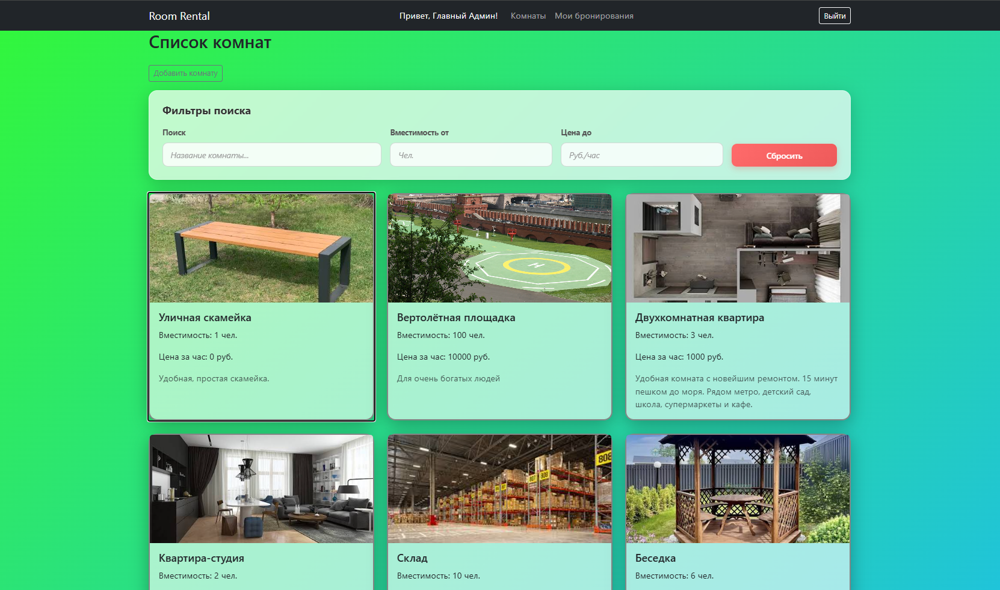
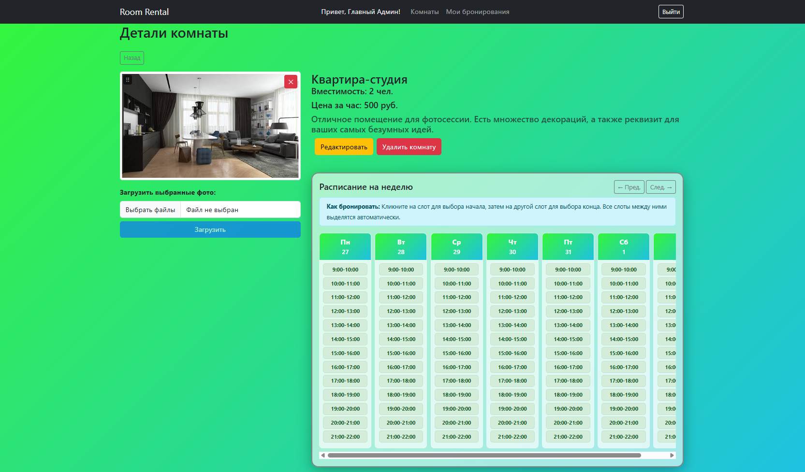
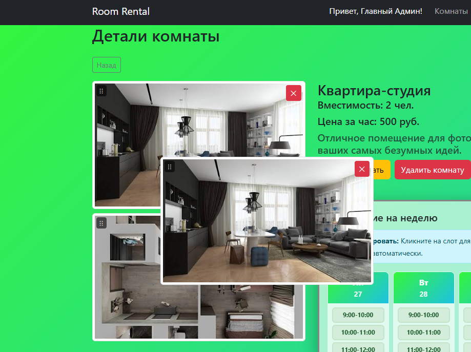
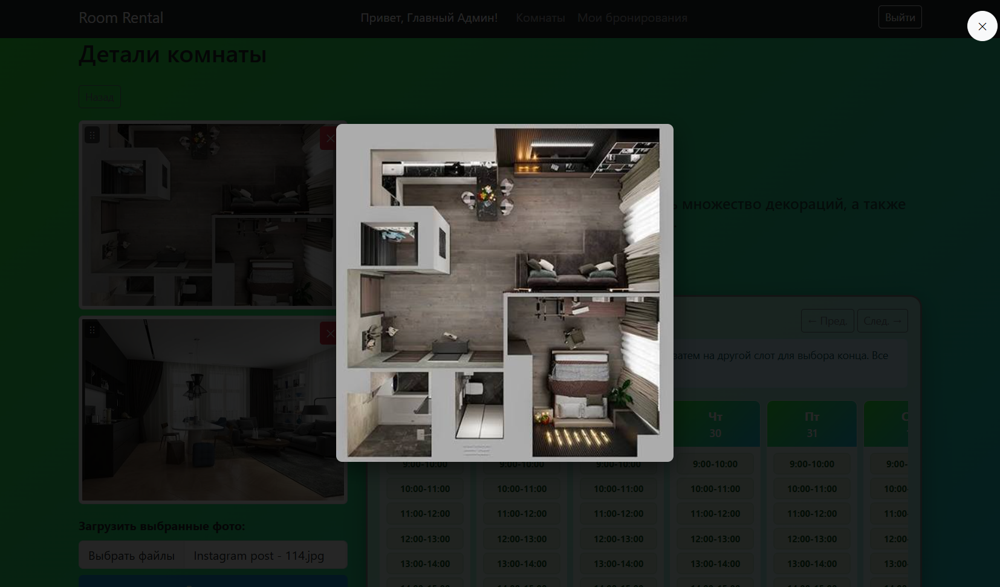
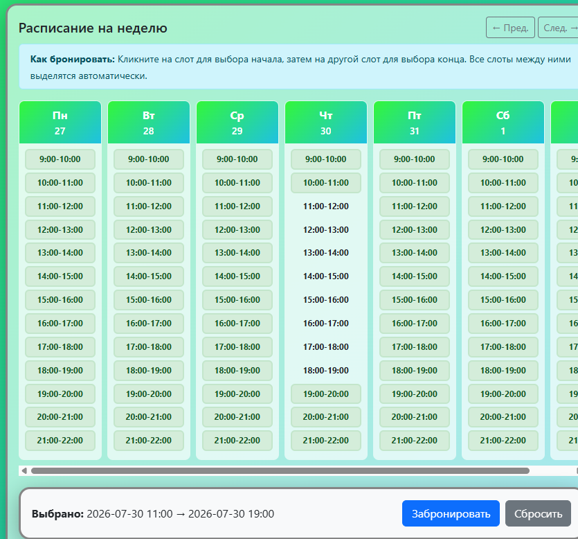
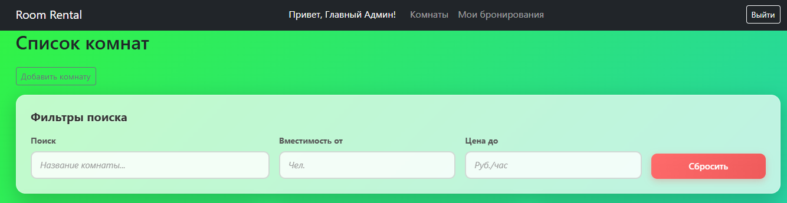
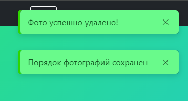
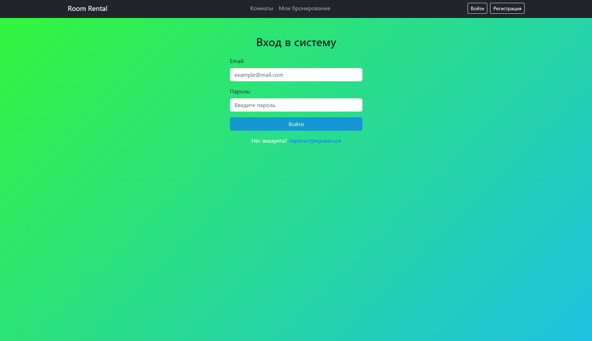

# RoomRental UI — Frontend

Современный SPA-клиент для системы бронирования помещений RoomRental. Реализован на Angular 21 с использованием реактивного подхода (RxJS), современных паттернов управления состоянием и интерактивных UI-компонентов.

>  **Серверная часть (ASP.NET Core API):** [RoomRental API](https://github.com/teteik/RoomRental)


---

## 📸 Интерфейс приложения

<!-- Замени плейсхолдеры на реальные скриншоты -->

| Список комнат с фильтрами | Детали комнаты |
|---|---|
|  |  |

| Drag-and-Drop сортировка | Лайтбокс (просмотр фото) |
|---|---|
|  |  |

| Бронирование (расписание) | Панель фильтров |
|---|---|
|  |  |

| Toast-уведомления | Страница логина |
|---|---|
|  |  |

---

## Стек технологий

### Основные технологии
- **Angular 21** — современный SPA-фреймворк (Standalone Components)
- **TypeScript 5** — строгая типизация
- **RxJS 7** — реактивное программирование (`BehaviorSubject`, `Observable`, `switchMap`, `forkJoin`, `combineLatest`, `takeUntil`)
- **Angular CDK** — Drag-and-Drop для сортировки фотографий
- **Bootstrap 5** — UI-компоненты и сетка
- **CSS3** — кастомные анимации, glassmorphism-эффекты

### Архитектурные паттерны
- **Standalone Components** — без `NgModules`, современный подход Angular 17+
- **Service-based Architecture** — логика вынесена в сервисы
- **Reactive State Management** — через `BehaviorSubject` и `Observable`
- **Optimistic UI** — мгновенное обновление интерфейса без ожидания ответа сервера
- **Route Guards** — защита маршрутов на основе ролей
- **HTTP Interceptors** — автоматическое прикрепление JWT-токена к запросам

---

## Архитектура проекта

Проект организован по функциональному признаку с четким разделением ответственности:

```text
src/
├── index.html              # Точка входа HTML
├── main.ts                 # Bootstrap приложения
├── styles.css              # Глобальные стили
│
└── app/
    ├── app.config.ts       # Конфигурация провайдеров (HTTP, Router, Animations)
    ├── app.routes.ts       # Маршрутизация с Guards
    ├── app.ts              # Корневой компонент
    │
    ├── components/         # UI-компоненты (по функциональности)
    │   ├── rooms/              # Список комнат + фильтры
    │   ├── room-details/       # Детали комнаты + галерея + расписание
    │   ├── room-form/          # Форма создания/редактирования комнаты
    │   ├── booking-form/       # Форма бронирования
    │   ├── my-bookings/        # Мои бронирования (User)
    │   ├── admin-bookings/     # Управление бронированиями (Admin)
    │   ├── admin-rooms/        # Управление комнатами (Admin)
    │   ├── login/              # Страница входа
    │   ├── register/           # Страница регистрации
    │   └── toast/              # Кастомные Toast-уведомления
    │
    ├── services/           # Бизнес-логика и работа с API
    │   ├── auth.service.ts         # Аутентификация, JWT, роли
    │   ├── auth.interceptor.ts     # Перехватчик HTTP-запросов (Bearer Token)
    │   ├── room.service.ts         # CRUD для комнат и фото
    │   ├── booking.service.ts      # Работа с бронированиями
    │   └── toast.service.ts        # Кастомный сервис уведомлений
    │
    └── guards/             # Защита маршрутов
        └── auth.guard.ts       # Проверка авторизации и ролей
```

---

## Ключевые фичи

### Аутентификация и авторизация
- **JWT-аутентификация** с хранением токена в `sessionStorage`
- **HTTP Interceptor** автоматически прикрепляет `Authorization: Bearer <token>` ко всем запросам
- **Route Guards** защищают страницы админки и личные кабинеты
- **Рендеринг по ролям** — кнопки "Редактировать", "Удалить", "Загрузить фото" видны только админам

### Интерактивная галерея фотографий
- **Мульти-загрузка** — выбор и отправка нескольких фото одним кликом
- **Drag-and-Drop сортировка** через Angular CDK с плавной анимацией
- **Лайтбокс** — просмотр фото на весь экран с затемнением фона
- **Оптимистичное удаление** — фото исчезает мгновенно, до ответа сервера

### Оптимистичный UI (Optimistic Updates)
- Использование `BehaviorSubject` для локального хранения состояния комнаты
- Мгновенное обновление интерфейса при загрузке/удалении/сортировке фото
- Автоматический откат при ошибке сервера
- Отсутствие лишних HTTP-запросов и перезагрузок страницы

### Поиск и фильтрация
- Динамический поиск по названию в реальном времени
- Фильтры по вместимости и цене
- Отправка параметров через `HttpParams` (query string)
- Кастомный glassmorphism-дизайн панели фильтров

### Интерактивное бронирование
- Визуальное расписание на неделю с почасовыми слотами
- Выбор диапазона времени (начало → конец) с автоматическим выделением
- Навигация между неделями (`← Пред.` / `След. →`)
- Автоматическая проверка доступности слотов

### UX/UI улучшения
- **Кастомный Toast-сервис** — уведомления с плавной CSS-анимацией появления/исчезновения
- **Glassmorphism-дизайн** — полупрозрачные карточки на градиентном фоне
- **Адаптивная верстка** — корректное отображение на мобильных устройствах
- **Плавные переходы** — hover-эффекты, анимации кнопок

---

## 🛠 Установка и запуск

### Требования
- **Node.js 18+** 
- **Angular CLI** 
- **Запущенный Backend API** ([инструкция](https://github.com/teteik/RoomRental]))

### Запуск через Docker (рекомендуется)

Запустите фронтенд одной командой:

```bash
docker-compose up --build -d
```

Приложение будет доступно по адресу: http://localhost:4200

### Альтернативный способ:
### 1. Клонирование репозитория
```bash
git clone https://github.com/teteik/room-rental-ui.git
cd room-rental-ui/src/app
```

### 2. Установка зависимостей
```bash
npm install
```

### 3. Запуск приложения
```bash
ng serve
```
Приложение будет доступно по адресу: `http://localhost:4200`

---

## Маршрутизация

| Путь | Компонент | Описание | Доступ |
|------|-----------|----------|--------|
| `/` | `RoomsComponent` | Список комнат с фильтрами | Публичный |
| `/rooms/:id` | `RoomDetailsComponent` | Детали комнаты + бронирование | Публичный |
| `/rooms/new` | `RoomFormComponent` | Создание комнаты | Admin |
| `/rooms/edit/:id` | `RoomFormComponent` | Редактирование комнаты | Admin |
| `/login` | `LoginComponent` | Вход в систему | Публичный |
| `/register` | `RegisterComponent` | Регистрация | Публичный |
| `/my-bookings` | `MyBookingsComponent` | Мои бронирования | User, Admin |
| `/admin/bookings` | `AdminBookingsComponent` | Управление бронированиями | Admin |
| `/admin/rooms` | `AdminRoomsComponent` | Управление комнатами | Admin |

---

## Ключевые зависимости

```json
{
  "@angular/core": "^21.2.0",
  "@angular/common": "^21.2.0",
  "@angular/router": "^21.2.0",
  "@angular/forms": "^21.2.0",
  "@angular/cdk": "^21.2.0",
  "rxjs": "~7.8.0",
  "bootstrap": "^5.3.0"
}
```

---

## Что реализовано (чек-лист)

- [x] Регистрация и вход с JWT-аутентификацией
- [x] Ролевая модель (Admin/User) с защитой маршрутов
- [x] CRUD для комнат с валидацией форм
- [x] Мульти-загрузка фотографий
- [x] Drag-and-Drop сортировка фото (Angular CDK)
- [x] Оптимистичный UI (Optimistic Updates)
- [x] Лайтбокс для просмотра фото
- [x] Интерактивное бронирование с выбором временных слотов
- [x] Поиск и фильтрация комнат
- [x] Кастомный Toast-сервис с CSS-анимациями
- [x] Glassmorphism UI дизайн
- [x] HTTP Interceptor для JWT
- [x] Route Guards для защиты страниц
- [x] Адаптивная верстка (Bootstrap 5)

---

## Roadmap (Планы по улучшению)

- [ ] Пагинация списка комнат (вместо загрузки всех сразу)
- [ ] Настройка расписания доступности комнат (24/7, рабочие часы, выходные)
- [ ] Unit-тесты для сервисов и компонентов (Jasmine + Karma)
- [ ] End-to-End тесты (Cypress или Playwright)
- [ ] Темная тема (Dark Mode)
- [ ] State Management через NgRx или Angular Signals
- [ ] Интеграция с картой для отображения локаций
- [ ] Уведомления в реальном времени (WebSocket / SignalR)

---

## Известные ограничения

- JWT-токен хранится в `sessionStorage` (для production рекомендуется использовать HttpOnly cookies)
- Отсутствует debounce при поиске (может создавать лишние запросы)
- Нет обработки оффлайн-режима

